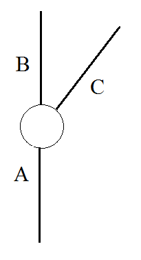
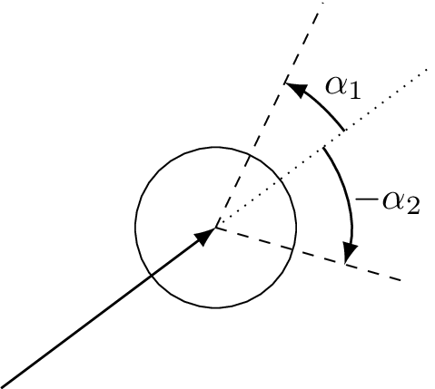

Problem B

# Bio Trip

**Ollie MacDonald** is in charge of a biological reserve used to study the nesting habits of birds. Scattered throughout the reserve are various types of nesting boxes, and one of Ollie’s tasks is to regularly check on the boxes. The only way to travel between the boxes is via a set of dirt roads which meet at various junctions in the reserve, and the only way for Ollie to travel on these roads is with an old, beat up tractor (funding hasn’t been the greatest for the past few years). Recently, a problem has developed with the steering mechanism of the tractor which limits the turning angles available. Since the junctions are relatively small, the roads that Ollie can take when entering a junction can be restricted. For example, in Figure 1, if Ollie enters the junction from road A he may be able to leave on either roads B or C, but if he enters via road B, the constrained turning angle may only allow him to leave on road A (the same could happen if he entered on road C).

In addition, due to uneven terrain, it is possible that traveling a road in one direction may take longer than traveling the road in the opposite direction.

As an example, Figure 2 illustrates the map of the reserve described in the first sample input. In this map, there are two ways to reach junction 3 and return to the biostation: visit all junctions in order in 9 minutes, or travel to junction 3 first, turn left and travel to junction 2 and then back to the start, for a total of 7 minutes.

Note that in this map, the travel times between two junctions is the same no matter which direction Ollie travels. This is not always the case with other maps.

Note also that the tractor cannot travel from the start to junction 3 and then turn right and head for junction 4, since that would require a 135-degree turn but the tractor can only make a 90-degree turn. Ollie also cannot make a U-turn — a 180-degree turn — and return to the biostation directly.

The junction at the biostation is large enough for Ollie to turn the tractor in any direction, so he can take any road leading from the biostation.

Given a layout of the roads, turning restrictions on the tractor and a destination box which Ollie needs to visit, he would like to know the minimum time he needs in order to get to the box and back.

Input
Input starts with a line containing four integers 𝑛 𝑑 𝛼1 𝛼2, where 𝑛 (2≤𝑛≤1000) is the number of junctions (numbered 1 to 𝑛), 𝑑 is the junction containing the bird box to visit, and 𝛼1 and 𝛼2 (0 < 𝛼1, 𝛼2 ≤ 180) specify the allowed turning angles in degrees (see Figure 3). The biostation is at junction 1 and is where Ollie’s journey both starts and ends. Following this are 𝑛 lines specifying the dirt roads. Each of these lines has the form 𝑚 𝑑1 𝑡1 𝑎1 𝑑2 𝑡2 𝑎2 … 𝑑𝑚 𝑡𝑚 𝑎𝑚. The 𝑖th of these lines indicates that there are 𝑚 dirt roads intersecting at junction 𝑖. The first of these roads ends at junction 𝑑1, needs 𝑡1 minutes to travel and leaves junction 𝑖 at angle 𝑎1 (where 0 is east, 90 is north, etc.); the second of these roads ends at junction 𝑑2, needs 𝑡2 minutes to travel and leaves junction 𝑖 at angle 𝑎2, etc. The maximum value of 𝑚 for any junction is 5 and the maximum value for any 𝑡𝑖 is 20.

Output
Output the minimum time for Ollie to travel from the biostation to the bird box at junction 𝑑 and back to the biostation. If it is not possible for Ollie to complete the trip, output impossible.

Sample Input 1

    4 3 90 90
    3 2 3 45 3 2 0 4 2 315
    2 1 3 135 3 2 270
    3 1 2 180 2 2 90 4 2 225
    2 1 2 135 3 2 270

Sample Output 1

    7

Sample Input 2

    2 2 90 90
    1 2 10 0
    1 1 15 180

Sample Output 2

    impossible

