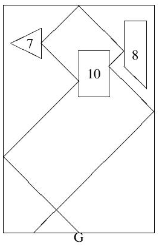

Problem D
Follow the Bouncing Ball
There are several games you can download on your phone that are variations of the following idea. The screen is filled with various convex geometric objects each with a number inside. At the bottom of the screen is a gun which fires 𝑛 balls in a rapid-fire manner when its trigger is pulled, each ball leaving the gun 1 second after the previous one. The gun swivels to allow you to set the direction for the balls. Once they leave the gun the balls will bounce off the geometric objects and the walls until they return to the bottom of the screen at which time they disappear. The balls do not interact with each other—if two balls intersect they simply pass through each other unimpeded.

Each time a ball hits one of the geometric objects, the number inside the object decrements by 1. The moment an object’s count reaches zero it disappears and the ball (or balls) that just hit it continues traveling without bouncing off the object. Consider the example in Figure 1: if the gun (indicated by the letter G) is facing to the left at a 45 degree angle then all the balls will follow the zigzag path starting at G. Note that the rectangular object can be hit twice by any one ball – once from the left and once from the right. Once this object is hit 10 times by any combination of left and right hits it will disappear and the paths of all balls on the screen will change accordingly.

In the actual games the goal is to get rid of all the objects as quickly as possible. Here we’re just interested in one sequence of balls fired from a fixed gun angle. More specifically, given the locations of a set of objects, the numbers inside of them, the number of balls shot and the orientation of the gun, determine what the final values will be in each of the objects.

Input

Input begins with seven values 𝑤 ℎ 𝑛 𝑚 𝑙 𝑟 𝑠 (all integers except for 𝑙, which has at most one decimal place). The first four denote the width and height of the screen (1≤𝑤,ℎ≤1000), the number of balls shot by the gun (1≤𝑛≤500), and the number of objects on the screen (1≤𝑚≤20). The last three describe the location of the gun along the bottom edge of the screen (0≤𝑙≤𝑤) and its orientation, as shown in Figure 2 (−10≤𝑟≤10, 1≤𝑠≤10).

Following this are 𝑚 lines describing the 𝑚 convex objects. Each of these lines starts with an integer 𝑝 indicating the number of edges of the object (3≤𝑝≤10), following by 𝑝 𝑥-𝑦 coordinates of the edge endpoints, given in clockwise order. Following this is an integer 𝑞 indicating the value inside the object (1≤𝑞≤1000). All lengths are in centimeters and the balls leave the gun traveling at 1 centimeter per second. No two objects (including the boundary of the screen) intersect each other, not even at a point. Objects are removed at the instant their values hit 0 or less. Any ball that hits an object within 10−7 second before its removal time will pass through the object as if it were removed. Finally, no ball will strike an edge within 10−7 of one of the edge’s endpoints and all balls will eventually leave the game screen.

Output

Output 𝑚 values indicating the final values in each of the 𝑚 objects, in the order that they appear in the input. If any of these values are negative just output 0 instead.

Sample Input 1	

    20 30 5 3 10 -1 1
    4 10 18 10 24 14 24 14 18 10
    3 5 23 1 25 5 27 7
    4 16 22 16 28 19 28 19 19 8

Sample Output 1

    0 2 3

Sample Input 2	

    20 30 10 3 10.1 -1 1
    4 10 18 10 24 14 24 14 18 10
    3 5 23 1 25 5 27 7
    4 16 22 16 28 19 28 19 19 8

Sample Output 2

    0 0 1
