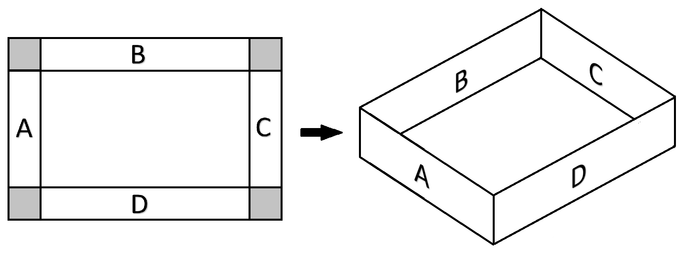

Problem H

Remainder Reminder

“Hey Bill, you were in charge of shipping those novelty book remainders to Remainderville, OH, right?” asked Fred. “Those were cute little books weren’t they, each shaped like a cube one inch on each side. I can’t understand why they didn’t sell better. Can you remind me how many we shipped?”

“Well,” started Bill, “I can’t remember the number exactly. I do remember that we tried three different size boxes. When we used the largest box size we had 407 books remaining after filling all of the rest completely. When we tried the second largest box size we had 409 books left over, and when we tried the smallest box size we only had 17 books left over.”

“Okay,” a slightly puzzled Fred continued, “then just let me know the box sizes and the number of boxes you used.”

“Funny thing” replied Bill, “I can’t remember that either. I do remember that the boxes were made from a 16 by 21 inch sheet of cardboard, with squares cut out at each of the four corners. We then folded the sides up to make an open top box, filled each box with books, then used packaging tape to attach a lid. The dimensions of each box were all integer multiples of inches.”

“You seem to have a very selective memory,” a now aggravated Fred complained.

“Well, if it helps, I know that the three different box sizes were the three largest possible to make from those sheets of cardboard. I also know that we had between 20,000 and 30,000 books to ship. I think that should give you enough to determine the total number of books.”

“So let me get this straight. You’re giving me the dimensions of the sheets of cardboard, the fact that the box sizes are the three largest that can be made from them, the number of books left over after using each of the box sizes, and a range in which the number of books lies, correct?” said Fred, rubbing his increasingly aching head.

“That’s it,” confirmed Bill.

“Sounds like some grossly convoluted computer programming problem!”

“Yeah. Go figure?”

Input

Input consists of seven positive integers 𝑎 𝑏 𝑐 𝑑 𝑒 𝑓 𝑔, where 𝑎 and 𝑏 (𝑎≤𝑏, 7≤𝑎,𝑏≤100) are the dimensions of the sheets of cardboard (in inches), 𝑐, 𝑑 and 𝑒 (1≤𝑐,𝑑,𝑒≤109) are the number of books left over for the three largest size boxes possible for the given size cardboard sheets (in order from largest box size to third largest box size) and 𝑓 and 𝑔 specify an inclusive range for the number of books (1≤𝑓<𝑔≤109).

Output

Output the number of books which satisfy all the conditions of the problem. Each problem is guaranteed to have a unique answer.

Sample Input 1	

    16 21 407 409 17 20000 30000

Sample Output 1

    22457

