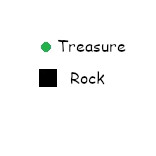
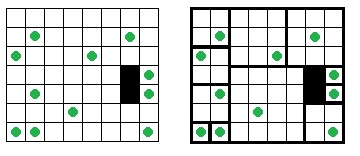

Problem I

Square Rooms

Bob Roberts is an archaeologist who specializes in the buildings of an ancient race known as the Erauqs. This ancient race was known not only for the fabulous treasures they amassed over the years, but also for the peculiar room layouts of their buildings. Their buildings were always rectangular and the rooms inside the buildings were always square shaped. (To preserve this property, some areas of the building were filled with solid rock.)

When Bob comes across evidence of a buried Erauqi building, he first uses an ultrasound device to find out as much about the layout of the building as possible before he starts digging. The ultrasound can tell him the location of any treasure and the rock locations, but it is not accurate enough to determine the locations of the walls. However, Bob knows that wall locations can be determined from the fact that the Erauqs always put exactly one treasure in each square room. For example, if the ultrasound were to show the locations of treasures and rock as shown in the left of Figure 1, then the only possible layout of the rooms would be as shown on the right.

Occasionally, Bob comes across a building by a rival tribe, the Elgnatcer. In these cases, it is not possible to find room layouts that are compatible with Erauqi architectural principles.

Bob’s come to you to write a program to locate the walls of the square Erauqi treasure rooms and to identify the non-Erauqi buildings. Frankly, the problem has been driving him up a wall.

Input

Input starts with a line containing two integers 𝑛 𝑚 (1≤𝑛,𝑚≤100), the number of rows and columns in the building grid. Following this are 𝑛 lines each containing 𝑚 characters. These characters are either ‘$’, ‘#’ or ‘.’ for treasure, rock or empty space. There are at least 1 and no more than 52 treasures.

Output

For each test case, if there is no way to assign square rooms to all of the empty spaces in such a way that each room contains one treasure, output elgnatcer. Otherwise, output an 𝑛 by 𝑚 grid indicating the layout of the Erauqi building. Assign to each square room a letter, starting with ‘A’, then ‘B’, ‘C’, …, ’Z’, ’a’, …, ’z’. Room labels are assigned by moving left to right across each row, starting at the topmost row (the first input row for the test case), and assigning the next room label to each unlabeled room as it is encountered. Each grid square in the output should contain either the corresponding room label or the character ‘#’ indicating rock.

Sample Input 1	

    7 8
    ........
    .$....$.
    $...$...
    ......#$
    .$....#$
    ...$....
    $$.....$

Sample Output 1

    AABBBCCC
    AABBBCCC
    DDBBBCCC
    DDEEEE#F
    GGEEEE#H
    GGEEEEII
    JKEEEEII

Sample Input 2	

    1 5
    #$#$#

Sample Output 2

    #A#B#

Sample Input 3	

    1 5
    #$.$.

Sample Output 3

    elgnatcer

